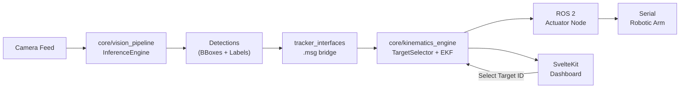
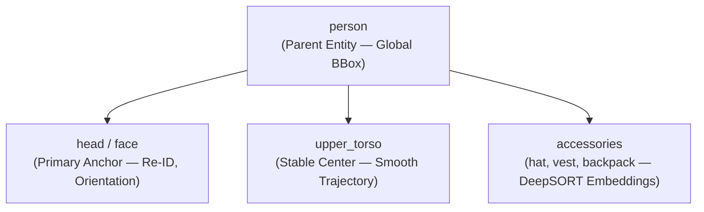

# ROC AI Vision — System Architecture

## High-Level Data Flow

---

## Subsystem Descriptions

### 1. Vision Pipeline (`core/vision_pipeline/`)

The front-end sensor processing layer. Acquires raw frames from a camera source and runs them through a dynamically-configured ONNX inference engine.

- **InferenceEngine:** Loads any `.onnx` model file, interrogates its input shape vector `[B, C, H, W]` at boot, and auto-configures the OpenCV preprocessing pipeline.
- **Letterbox Preprocessing:** Scales the source frame while maintaining aspect ratio, padding dead space with `(114, 114, 114)` gray pixels.
- **Output:** Raw detection tensors (bounding boxes, class labels, confidence scores) passed downstream via ROS 2 messages.

### 2. Kinematics Engine (`core/kinematics_engine/`)

The mathematical core. Receives detection arrays and produces smoothed tracking states and actuator commands.

- **TargetSelector:** Multi-object selection matrix. Groups sub-features (head, upper_torso, accessories) to parent `person` entities via spatial proximity. Selects the optimal target based on configurable priority weights relative to a screen-center reference point.
- **EKF Tracker:** Extended Kalman Filter implementing a constant-acceleration state model. Maintains position and velocity estimates for each tracked entity.
- **DeepSORT Integration:** Appearance embedding vectors for persistent re-identification across occlusions and path crossings.
- **Output:** Smoothed translation vector `(dx, dy)` for reference point alignment; full kinematic state vector per entity.

### 3. Tracker Interfaces (`ros2_ws/src/tracker_interfaces/`)

Custom ROS 2 `.msg` definitions that form the data contract between the vision and kinematics layers.

- Detection arrays (bounding boxes with labels and confidence).
- Tracked entity state messages (ID, position, velocity, acceleration, label hierarchy).
- Actuator command messages (target ID, translation vector, intercept path).

### 4. ROS 2 Vision Nodes (`ros2_ws/src/roc_vision_nodes/`)

Executable ROS 2 nodes that orchestrate the full pipeline.

- **Vision Acquisition Node:** Camera driver → frame capture → InferenceEngine → publish detection messages.
- **Actuator Control Node:** Subscribe to tracking state → compute actuator deltas → serial command output to robotic hardware.
- **Launch Configuration:** Parameterized launch files for sensor sources, model paths, and actuator serial ports.

### 5. SvelteKit Dashboard (`dashboard/`)

Real-time web-based telemetry visualization overlay.

- **Structural Blueprint:** `dashboard/architecture_plan.md` defines the modular controller shell boundaries (`TelemetryCanvas`, `NavigationShell`, `AimingAccessoryPanel`). Hot-path rendering must not absorb UI navigation or config mutation.
- **WebSocket Bridge:** Subscribes to ROS 2 tracking topics via rosbridge_server for live coordinate streaming.
- **SVG Telemetry Canvas:** Renders entity bounding boxes, trajectory paths, and ID labels as responsive SVG vectors.
- **Interactive Target Selection:** Click on any tracked entity ID to command the TargetSelector to lock onto that entity. The selection propagates through ROS 2 to the actuator node.
- **Performance:** Direct DOM attribute updates, buffer recycling in WebSocket stores, zero Virtual DOM overhead.

---

## Entity Hierarchy Model

The tracking system maintains this hierarchy per detected humanoid. The `upper_torso` provides the stable center-of-mass for smooth path trajectories, while the `head` coordinates enable precision monitoring and directional sensor pointing. Accessories contribute to the appearance embedding vector for persistent re-identification.

---

## Coordinate Flow

1. **Camera space** → Raw pixel coordinates from the sensor.
2. **Model space** → Letterboxed and normalized coordinates matching the ONNX input dimensions.
3. **Detection space** → Bounding box coordinates in the original frame after inverse letterbox transform.
4. **Tracking space** → Smoothed EKF state vectors in the reference coordinate system.
5. **Actuator space** → Physical delta angles/positions for the robotic arm, computed from the kinematic intercept path.
