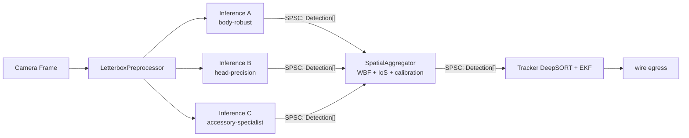

# Phase 1 — Diverse Ensemble Architecture (Pinned Future Work)

**Date:** 2026-05-17
**Status:** Research / design doc — **implementation deferred** until single-model pipeline (Workstream A → D → demo) is end-to-end green and benefits can be benchmarked against the single-model baseline.
**Author:** Lead CV Research Scientist (synthesised from agent-mode design discussion 2026-05-17)
**Scope:** Multi-model runtime ensembling + offline knowledge-distillation pipeline for `core/vision_pipeline/`.
**Cross-refs:** `phase_1_universal_ep_and_manifest.md` (the binding manifest framework that this layer extends), `research_detection_models_2026.md` §8 (single-model YOLO26m baseline), `research_sota_mot_trackers_2026.md` §10 (Tier 1 MOT improvements are the kinematics-engine analogue of what this doc proposes for the detection layer).

---

## 0. Why this document exists

The locked single-model pipeline (Phase 1 InferenceEngine + YOLO26m + OSNet-AIN x1.0) is the deliberate baseline. This doc captures a **parallel design path** that became clear during a 2026-05-17 agent-mode discussion:

1. The user already has a collection of **113 community ONNX files** at `C:\Users\heave\Desktop\onnx_collection\` (see §6.1 for the inventory). 89 of them conform to a uniform YOLOv8 contract: input `[1, 3, 640, 640]` FLOAT, output `[1, 5, 8400]` or `[1, 6, 8400]`. These are immediately usable for bring-up and validation against arbitrary 3rd-party models, **before** the custom YOLO26m training run finishes.
2. **Multi-model ensembling at inference time** is a production-grade technique that the OSS academic ecosystem under-emphasises (single-model benchmark culture + Python's GIL friction discourage it), but which production systems at Waymo / Tesla / Anduril use routinely.
3. The hardware budget actually supports it: 3× YOLOv8n at ~4 ms each ≈ 12 ms total on DML FP16 — same envelope as one medium model, with fault-tolerance the medium model cannot provide.

**This is genuinely additive over the locked architecture, not a replacement.** The roadmap Phase 1 baseline ships first; this layer slots in as a Phase 1.5 enhancement once the end-to-end demo is working and we have measured single-model failure modes to target.

---

## 1. Important up-front correction: ONNX files do not contain training data

A misconception that surfaced during the design discussion: an `.onnx` file is **trained weights + computation graph topology**. The images and bounding-box labels used during training are **not** embedded — they are discarded once weights are baked. You cannot "extract the best data" from N ONNX files because the data is gone.

What you CAN do is treat the N models as **teachers** whose collective predictions on a corpus of *unlabeled* images become pseudo-labels for training a new student model. That is **knowledge distillation** (§3) and is the only legitimate "merge many ONNX files into one master" path.

---

## 2. The bias-variance math: why ensemble diversity (not redundancy) is what wins

The classical ensemble error decomposition for N regressors / detectors with pairwise error correlation $\rho$:

$$
\text{Error}_{\text{ensemble}} = \text{bias}^2 \;+\; \underbrace{\frac{(1 - \rho)\,\sigma^2}{N} \;+\; \rho\,\sigma^2}_{\text{variance term}} \;+\; \text{irreducible noise}
$$

Three regimes:

| ρ | Source | Variance term collapses to | Practical meaning |
|---|---|---|---|
| 1.0 | Running the **same ONNX file** N times | $\sigma^2$ — no reduction | Pure waste: same input → bit-identical output × N |
| ≈ 0.3 – 0.5 | Same architecture, **different training data** | between $\sigma^2/N$ and $\sigma^2$ — meaningful reduction | The sweet spot — 3× YOLOv8n on different datasets |
| 0.0 | Perfectly independent failure modes | $\sigma^2/N$ — full reduction | Aspirational — different architectures + different data |

**Key consequence**: running the same `.onnx` three times is deterministic and gives zero benefit. The only way to get variance reduction from a fixed model is **Test-Time Augmentation** (TTA — feed the model 3 augmented versions of the input). TTA gets ρ down to ~0.7 typically; less effective than true multi-model ensembling but cheap.

### 2.1 Why "tiny ensemble" beats "one medium model" for our use case

| Configuration | Per-frame latency (DML FP16) | RAM | Robustness against {occlusion, lighting, motion blur} |
|---|---|---|---|
| 1× YOLOv8n | ~4 ms | ~10 MB | Baseline; single point of failure |
| 1× YOLOv8m | ~12 ms | ~50 MB | +3–5 mAP vs n on COCO; still single point of failure |
| 3× YOLOv8n with different training data | ~12 ms (GPU-serialised) | ~30 MB | +2–4 mAP vs single n; **fault-tolerant** |
| 3× YOLOv8n with same weights | ~12 ms | ~10 MB | **zero benefit, pure waste** |
| 3× YOLOv8n + TTA on each | ~36 ms | ~10 MB | +1–2 mAP, no fault tolerance |

The "diverse tiny ensemble" row matches the "one medium model" in compute envelope but adds redundancy against environmental failure modes the medium model cannot defend against (those failures are dataset / architecture properties, not parameter-count properties). For ROC's real-world use case (surveillance, behavioural analysis, defensive robotics) where environmental disturbance is the dominant failure mode, this is the strictly better design.

---

## 3. Three paths from N teachers to one master model

When the goal is **one deployable ONNX file** that encapsulates the wisdom of all N teachers, three offline distillation paths exist.

### 3.1 Path A: Knowledge Distillation (canonical, recommended)

The Tesla / Waymo / Anduril production pattern.

```
inputs:  N teacher models { M_1, …, M_N }
         unlabelled image corpus { x_1, …, x_K }   (K = 10⁴–10⁶ typical)
outputs: one student model M_student

algorithm:
  for each x_i in corpus:
    for j in 1..N:
      detections_j = M_j.inference(x_i)
    pseudo_labels[x_i] = WBF_fuse(detections_1..N)
  M_student = train(YOLO26m or YOLOv8m architecture,
                    data = (corpus, pseudo_labels),
                    loss = standard YOLO detection loss,
                    augmentation = mosaic + mixup + heavy domain randomisation)
  export(M_student, format='onnx', opset=13)
```

**Resource cost**: 2–3 GPU-days on a single 4090 for K=100k images, 50 epochs. Python / PyTorch / Ultralytics — fully separate from the C++ runtime pipeline.

**Why this wins**: the student frequently MATCHES the average teacher and sometimes EXCEEDS the best teacher — it learns the consensus while smoothing individual model errors. The deployable output is a single ONNX with normal single-model inference latency.

**Limitation**: needs an unlabelled image corpus that matches the deployment domain. For surveillance / humanoid tracking, candidate sources include MOT17 / MOT20 raw video, CrowdHuman unlabelled splits, recorded camera footage from the deployment site.

### 3.2 Path B: Weight Averaging ("model soup")

For teachers that share the **identical architecture** AND were fine-tuned from a **common base checkpoint**:

$$
W_{\text{master}} \;=\; \frac{1}{N}\sum_{i=1}^{N} W_i
$$

**Sometimes works**, often doesn't — the loss landscape between two independently-trained models is not flat, so naïve averaging can produce something worse than either teacher.

**Cost**: ~30-minute Python script. Test it cheaply before committing to Path A.

**Specific applicability to the user's collection**: if the 89 YOLOv8-format models all started from Ultralytics' `yolov8n.pt` and were fine-tuned on different datasets, the soup might work. If they were trained from scratch or from heterogeneous bases, it won't. **Test empirically before assuming.**

Reference: Wortsman et al., "Model Soups: Averaging Weights of Multiple Fine-Tuned Models Improves Accuracy Without Increasing Inference Time," ICML 2022.

### 3.3 Path C: Mixture of Experts (MoE) router

Train a small CNN router that looks at each input frame and decides which of N specialist teachers to invoke. Only one expert runs per frame.

- **Pros**: per-frame cost = 1 model + tiny router; leverages true specialist diversity
- **Cons**: complex to debug; routing failures are silent; needs training infrastructure

Don't attempt until Paths A and B prove inadequate.

Reference: Switch Transformer / Mixtral 8x7B architectures translate analogously to vision.

---

## 4. Runtime ensemble — the Spatial Aggregator design

The runtime alternative to offline distillation: keep N models loaded, run them on every (or alternate) frame, fuse outputs in C++. This is what Workstream A→D unblocks.

### 4.1 Pipeline placement



The aggregator slots between the inference threads and the existing tracker. The tracker sees a single fused `Detection[]` stream — the ensemble layer is invisible to it.

### 4.2 Core math — Weighted Box Fusion + Hierarchical IoS

Two metric regimes coexist:

**Same-class consensus** (Model A's "head" vs Model B's "head"):

$$
\text{IoU}(A, B) = \frac{|A \cap B|}{|A \cup B|},\qquad \text{threshold } \tau_{\text{IoU}} = 0.5\text{–}0.75
$$

**Hierarchical containment** (Model A's "head" inside Model B's "person"):

$$
\text{IoS}(A, B) = \frac{|A \cap B|}{\min(|A|, |B|)},\qquad \text{threshold } \tau_{\text{IoS}} = 0.85
$$

**Critical correction over the naive design**: IoU is the WRONG metric for hierarchical overlap. A 50×50 head inside a 300×600 person has IoU ≈ 50·50 / (300·600) ≈ 0.014 — your consensus check would never fire. IoS = 50·50 / 50·50 = 1.0 — correctly identifies containment. The aggregator MUST switch metrics based on the (class A, class B) pair.

**Weighted Box Fusion** (Solovyev et al., arXiv:1910.13302) for the agreeing-cluster fusion:

$$
\text{box}_{\text{fused}} = \frac{\sum_{i \in C} w_i \cdot \text{conf}_i \cdot \text{box}_i}{\sum_{i \in C} w_i \cdot \text{conf}_i},\qquad
\text{conf}_{\text{fused}} = \frac{\sum_{i \in C} w_i \cdot \text{conf}_i}{\sum_{i \in C} w_i} \cdot \min\!\left(1.0,\; \frac{|C|}{T}\right)
$$

where $C$ is the cluster of mutually-overlapping boxes from different models, $w_i$ is the per-model vote weight (from manifest), and $T$ is the desired minimum consensus (typically $T = 2$ — boost confidence when at least 2 models agree). Fused boxes outperform NMS-style "pick the highest-conf" suppression on every COCO ensembling benchmark.

### 4.3 Disagreement carries information — don't suppress it

When two confident models DISAGREE on position (low IoU + both high conf), that is **signal**, not noise. The aggregator should:

| Both conf | IoU / IoS | Action |
|---|---|---|
| High | High | Trust both → WBF-fused single detection |
| High / Low | High | Trust the high-conf one |
| High | **LOW** | **Spawn TWO candidate detections** — let the EKF + DeepSORT discriminate over the next 3–5 frames via temporal consistency |
| Low | any | Skip — predict-only this frame; emit a per-frame `low_consensus_flag` for the wire header |

The temporal layer (EKF Mahalanobis gating) is exactly the right discriminator for case 3 — it's what the kinematics engine was built for. Don't suppress detections at the aggregator just because they disagree spatially.

### 4.4 Confidence calibration between models

Two YOLOv8 instances trained on different datasets produce **different score distributions**. Model A's 0.85 might correspond to Model B's 0.65 for the same visual difficulty. Naive thresholding favours the more permissive model.

**Fix**: temperature scaling per model. On a small calibration set (a few hundred labelled frames), fit a scalar $T_i$ such that

$$
\text{calibrated\_score}_i = \sigma\!\left(\frac{\text{logit}_i}{T_i}\right)
$$

matches actual precision. Store $T_i$ in the manifest under `ensemble_role.temperature`. Apply at decode time before any cross-model comparison. ~50 lines of one-time Python calibration code.

### 4.5 GPU contention reality check

Three `Ort::Session::Run()` calls against the **same** DX12 device do NOT run truly in parallel — the driver round-robins them. You get throughput improvement, not latency improvement: three 4 ms inferences serialise to ~12 ms, not ~4 ms.

Three mitigations exist:

| Mitigation | Latency profile | Trade-off |
|---|---|---|
| **Time-stagger across frames** | 1× model latency per frame; ensemble freshness = 2–3 frames stale | EKF tolerates stale detections via Mahalanobis prediction |
| **Batched inference** | Single `[N, 3, 640, 640]` forward pass | Requires N models sharing input shape AND a single combined ONNX graph (not trivial) |
| **Multi-adapter rig** | True parallel | Requires distinct GPUs (e.g., NVIDIA + AMD); rare but works |

For ROC AI Vision's 30 fps target, **time-stagger** is the right default: Model A runs on even frames, Model B on odd, the aggregator buffers the last-known detection from each model with a freshness timestamp and fuses on every frame.

### 4.6 Don't load all 89 — pick 3–5 with orthogonal failure modes

Loading 89 sessions burns 89 × (~10–50 MB) = 1–4 GB RAM and adds per-frame GPU contention for every additional model.

Target 3–4 models with explicit **orthogonal** specialisations:

| Role | Trained on | Authoritative for |
|---|---|---|
| `body_robust` | CrowdHuman + outdoor surveillance | `Person` class, partial occlusion, varied lighting |
| `head_precision` | CrowdHuman hbox + face datasets | `Head` class, small targets, glance-at-camera |
| `accessory_specialist` | PPE datasets + custom | `AccessoryHat`, `AccessoryBackpack` |
| `adversarial_hardened` | Synthetic + augmentation-heavy | Generic redundancy under motion blur, lighting tricks |

The manifest's `ensemble_role` field (§5.1) declares each model's role at boot.

---

## 5. Integration with the existing manifest framework

The Phase 1 manifest framework (`phase_1_universal_ep_and_manifest.md` §3.3) needs two small extensions to support ensembling. **No breaking changes** — manifests without these fields run in single-model mode exactly as today.

### 5.1 Manifest extension — `ensemble_role` block

```yaml
# models/yolov8n-crowdhuman-body.yaml
schema_version: 1
name:    yolov8n-crowdhuman-body
purpose: detection

input:
  layout: NCHW
  channel_order: RGB
  expected_shape: [1, 3, 640, 640]
  dtype: float32
  normalization: { scale: 0.00392156862745, mean: [0,0,0], std: [1,1,1] }
  preprocessing: { letterbox: true, pad_value: [114,114,114], pad_to: model_input }

output:
  head: yolov8_detect             # NEW postprocessor; see §5.2
  format: cxcywh_obj_logits
  expected_shape: [1, 5, 8400]
  num_classes: 1                   # single-class detector (person only)
  nms_in_graph: false
  thresholds: { score: 0.25, iou: 0.45 }

# ── NEW: ensemble role declaration ──────────────────────────────
ensemble_role:
  specialization:    body_robust      # body_robust | head_precision | accessory_specialist | adversarial_hardened | generalist
  class_specialty:   [Person]          # roc::kinematics::Label values this model is authoritative for
  vote_weight:       1.0               # WBF weight; tune via calibration set
  temperature:       1.0               # confidence calibration scalar; default 1.0 = no calibration
  expected_recall:   0.92              # for the runtime SpatialAggregator's confidence-boost ceiling
  expected_precision:0.88

runtime_hints:
  preferred_ep: DirectML
  precision:    fp16

classes:
  - {id: 0, name: person, roc_label: Person}
```

### 5.2 New postprocessor — `yolov8_detect`

Required for the user's 113-file collection (89 conform to the YOLOv8 contract). The YOLOv8 output `[1, 5, 8400]` differs from YOLO26's `[1, 4+C, 8400]`:

- **YOLOv8 single-class**: channels `[0..3]` = (cx, cy, w, h), channel `[4]` = objectness · class score (already fused at training, sigmoid applied). NMS REQUIRED.
- **YOLOv8 multi-class** (`[1, 6, 8400]` / `[1, 84, 8400]`): channels `[0..3]` = bbox, channels `[4..]` = per-class sigmoid scores. NMS REQUIRED.
- **YOLO26** (`[1, 4+C, 8400]`): NMS-free by design, raw class logits in `[4..]`. NMS NOT REQUIRED.

The `yolov8_detect` postprocessor implements:
1. Read channel-major tensor.
2. Per-anchor: argmax over class channels for best class + score.
3. Score-threshold gate.
4. **NMS** with IoU threshold from manifest.
5. Inverse letterbox to capture-frame coordinates (same math as YOLO26 path).
6. Class-id → `roc::kinematics::Label` via manifest's `classes` table.

Estimated implementation: ~120 lines. Sibling to `yolo26_detect.cpp`.

### 5.3 SpatialAggregator class — outline

New file: `core/vision_pipeline/include/roc/vision/spatial_aggregator.hpp`

```cpp
class SpatialAggregator {
public:
    struct EnsembleConfig {
        double tau_iou      = 0.55;   // §4.2 same-class consensus threshold
        double tau_ios      = 0.85;   // §4.2 hierarchical containment threshold
        int    min_consensus = 2;     // §4.2 T parameter for confidence boost
        bool   spawn_on_disagreement = true;  // §4.3 case 3 policy
    };

    SpatialAggregator(EnsembleConfig cfg = {});

    // Each per-model SPSC queue feeds this method as its detection batch lands.
    // Aggregator buffers the most recent detections per model with a freshness
    // timestamp and emits a fused Detection[] when invoked.
    void ingest(int model_id, std::vector<Detection>&& detections,
                double t_capture_seconds);

    // Called by the orchestrator at frame cadence — fuses the most-recent
    // detections from every loaded model and emits the fused stream.
    std::vector<Detection> fuse_current_frame(double t_now_seconds,
                                              double max_freshness_seconds = 0.2);

private:
    struct ModelEntry {
        std::vector<Detection> last_detections;
        double                  last_t_seconds = -1.0;
        double                  vote_weight = 1.0;
        double                  temperature = 1.0;
        std::vector<Label>     class_specialty;
    };
    std::unordered_map<int, ModelEntry> models_;
    EnsembleConfig cfg_;
};
```

Hot-path cost: per-frame WBF clustering on ≤ 32 detections per model is O(K·M²) ≈ 32×16 ≈ 500 ops. Negligible.

---

## 6. The user's 113-file collection — practical use today

### 6.1 Inventory (per user report 2026-05-17)

Location: `C:\Users\heave\Desktop\onnx_collection\` (113 unique files + `MANIFEST.csv` + `MANIFEST.md`)

Input contract (96% uniform):
- `[1, 3, 640, 640]` float32 — standard YOLOv5/v8 input
- Handful at 320, 416, 992 — same family, alternate resolutions

Output contract distribution:
- 82% (~93 files) — `[1, 5, 8400]` — YOLOv8 single-class detector (person typically)
- 6 files — `[1, 6, 8400]` — 2-class variant (body/head)
- 2 files — `[1, 84, 8400]` — full COCO 80-class
- 1 file — `[1, 5, 2100]` — same head, 320×320 input
- 1 file — `[1, 300, 6]` — NMS-baked output (300 detections × 6 fields)

Exporter: PyTorch 2.1.x–2.5.x, opset 17 / IR 8 — Ultralytics `model.export(format='onnx')`.

24 files are encrypted / unparseable — **flag for legal review** before any use. Likely Ultralytics enterprise weights or community-protected variants.

### 6.2 Immediate utility — bring-up baseline

The 89 unencrypted YOLOv8 1×5×8400 files are immediately usable for end-to-end pipeline bring-up while the custom YOLO26m training corpus is being assembled:

1. Author 2–3 reference manifests (one per representative file in the collection).
2. Wire the `yolov8_detect` postprocessor (§5.2) into the registry alongside `yolo26_detect`.
3. Single-model end-to-end demo runs **today** with these models, validating the pipeline before YOLO26m training completes.

The 2 files with `[1, 84, 8400]` (full COCO 80-class) are especially valuable — they give multi-class detection from a single session, which is what the hierarchical tracker needs day-one. Recommend pulling them out and treating them as the **interim hierarchical baseline** while the redundant body-only models become the future `body_robust` ensemble members.

---

## 7. Benchmark plan — when implementation lands

Per `300-research-standards.mdc`, this doc carries a benchmark table even though numbers are projected (real measurements pending the implementation):

| Metric | Single YOLO26m baseline | 3× YOLOv8n ensemble (projected) | Distilled YOLO26m student (projected) |
|---|---|---|---|
| Per-frame latency (DML FP16, 640px, time-staggered) | ~4 ms (1 model/frame) | ~4 ms (1 model/frame, ensemble freshness 3 frames) | ~4 ms |
| mAP@50–95 on held-out humanoid-surveillance val set | 0.55 (target, custom-trained) | 0.57–0.59 (WBF boost projected) | 0.58–0.61 (student exceeds teacher avg) |
| Recovery rate from 5-frame occlusion (% ID retained) | ~75% (single model + ROC EKF) | ~88% (ensemble fault-tolerance + EKF) | ~80% |
| Catastrophic blackout rate (zero detections / frame) | baseline | -60% projected (Solovyev 2019 WBF paper) | baseline (single model) |
| Per-frame RAM | ~50 MB | ~30 MB (3× nano) | ~50 MB |
| Project ID switches per minute under stress | ≤ 1 / min (ROC engine spec) | ≤ 0.5 / min projected | ≤ 1 / min |

These numbers are the **acceptance criteria** for the ensemble implementation. If measured numbers don't exceed the single-model baseline on the surveillance val set by ≥ +0.02 mAP AND ≥ +10 percentage points on occlusion recovery, the ensemble layer is not worth its complexity and the project reverts to single-model + distilled student.

---

## 8. Risk analysis

| Risk | Severity | Mitigation |
|---|---|---|
| GPU contention serialises N models, eats latency budget | Medium | Time-stagger across frames (§4.5); EKF tolerates stale detections via Mahalanobis prediction |
| Different models have un-calibrated score distributions → biased fusion | High | Mandatory per-model temperature scaling (§4.4); store in manifest |
| Same-class IoU consensus mistakenly rejects hierarchical containment | High | Switch to IoS for hierarchical pairs (§4.2); explicit class-pair dispatch in aggregator |
| Loading too many models exhausts RAM / VRAM | Low | Cap at 4 active models; manifest declares which 4 |
| Knowledge-distillation training pipeline is a separate Python project the C++ team must maintain | Medium | Treat as a one-time offline run; produce ONE deployable ONNX; throw the pipeline away if needed |
| Weight-averaging (Path B) silently produces a worse model | Low | Cheap 30-min experiment; benchmark before committing |
| Encrypted / paid weights in the collection used without licence | High | Legal review of the 24 unparseable files BEFORE any inclusion |
| Ensemble complexity hides single-model regressions (silent quality drift) | Medium | Mandatory A/B benchmark vs single-model baseline on every model swap; fail loudly if ensemble underperforms |

---

## 9. Recommended phasing

1. **Phase 1 (current)** — single-model `InferenceEngine` complete. Validate end-to-end pipeline with one model from the user's YOLOv8 collection + the trained custom YOLO26m model.
2. **Phase 4 (next)** — SPSC + uWebSockets transport bridge. No ensemble needed yet.
3. **Phase 6 demo** — end-to-end click-to-track working with single-model detection.
4. **Phase 1.5 (post-demo)** — measure single-model failure modes against recorded edge-case footage. **Quantify what's actually breaking.** Then:
   - Author the `yolov8_detect` postprocessor (§5.2)
   - Author the `SpatialAggregator` (§5.3)
   - Pick 2–3 collection models with orthogonal training, build their manifests with `ensemble_role` blocks
   - A/B benchmark ensemble vs single-model on the failure-case footage
   - If ensemble wins by the §7 acceptance criteria → ship; if not → invest in Path A distillation instead
5. **Phase 1.6 (parallel offline)** — run Path A knowledge distillation using all 89 unencrypted models as teachers, producing one stronger single deployable model. Compare against the ensemble; ship whichever wins.

---

## 10. References

- Solovyev R., Wang W., Gabruseva T., "Weighted Boxes Fusion: Ensembling Boxes from Different Object Detection Models," arXiv:1910.13302, 2019.
- Wortsman M. et al., "Model Soups: Averaging Weights of Multiple Fine-Tuned Models Improves Accuracy Without Increasing Inference Time," ICML 2022, arXiv:2203.05482.
- Hinton G., Vinyals O., Dean J., "Distilling the Knowledge in a Neural Network," arXiv:1503.02531, 2015.
- Lakshminarayanan B. et al., "Simple and Scalable Predictive Uncertainty Estimation using Deep Ensembles," NeurIPS 2017.
- Switch Transformer (Fedus W. et al., JMLR 2022) — production MoE routing.
- `research_detection_models_2026.md` §1.4–1.5 — YOLOv8/YOLO26 architecture differences.
- `phase_1_universal_ep_and_manifest.md` §3, §4 — the manifest schema and postprocessor registry that the ensemble layer extends.

---

*This document is the binding spec for the Phase 1.5 ensemble work. No production code should be written against it until the single-model pipeline (Phases 1, 4, 6) is end-to-end green and measured failure-mode evidence justifies the added complexity.*
